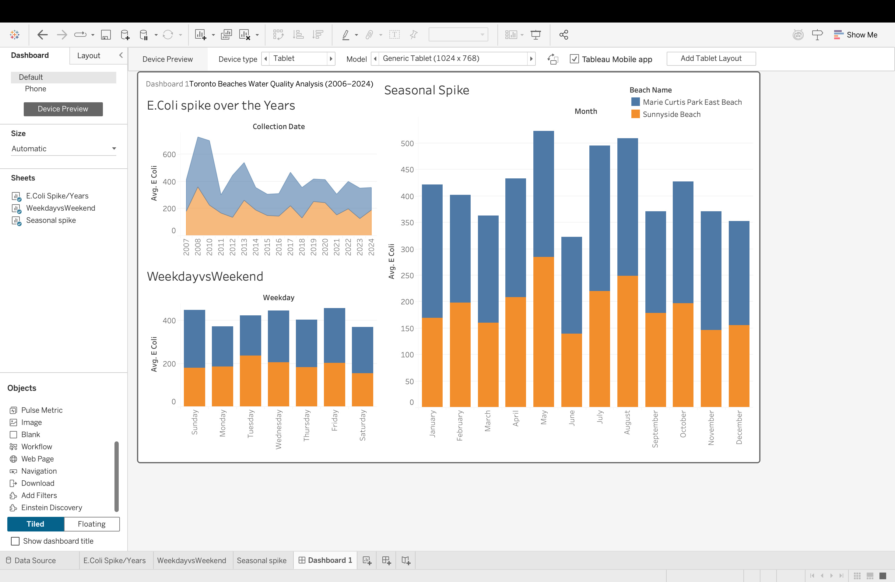

# Toronto Beach Water Quality Dashboard (Tableau)

An interactive data visualization project analyzing E.Coli levels across Toronto beaches.

## Tools Used
- Tableau (for data visualization)
- Google Sheets (data cleaning)
- Public Dataset: City of Toronto open data portal

## Key Features
- Yearly trend of E.Coli levels (2005–2024)
- Comparison of Marie Curtis Park vs Sunnyside Beach
- Safe-to-swim visualization with thresholds
- Geographic Map of all beach locations

## Files Included
- `Toronto_Beach_Water_Quality_Analysis.twbx`: Tableau dashboard
- `toronto-beaches-water-quality.csv`: Cleaned dataset
- Screenshots of dashboard
- This `README.md`

## Key Insights:

2009 saw an extreme spike in E. Coli counts – could be due to testing anomalies or environmental events (remains a red flag).
Summer months (May–August) see a noticeable increase in E. Coli – just as people are flocking to beaches!
Weekends show consistently higher E. Coli levels – possibly due to increased human activity or delayed water sampling.
Sunnyside Beach often has higher average E. Coli levels than Marie Curtis Park – something to consider for your next beach day.

## Screenshot

## Demo
You can download and view the full dashboard using [Tableau Public](https://public.tableau.com/en-us/s/download)

---
